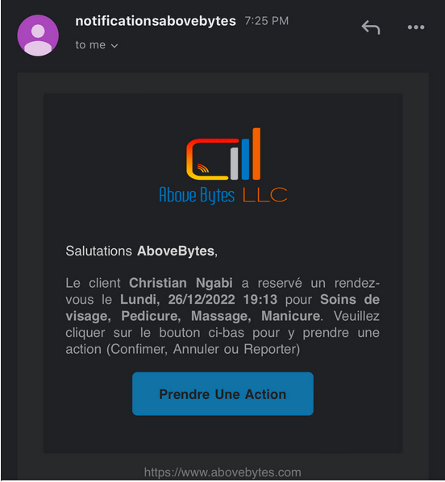
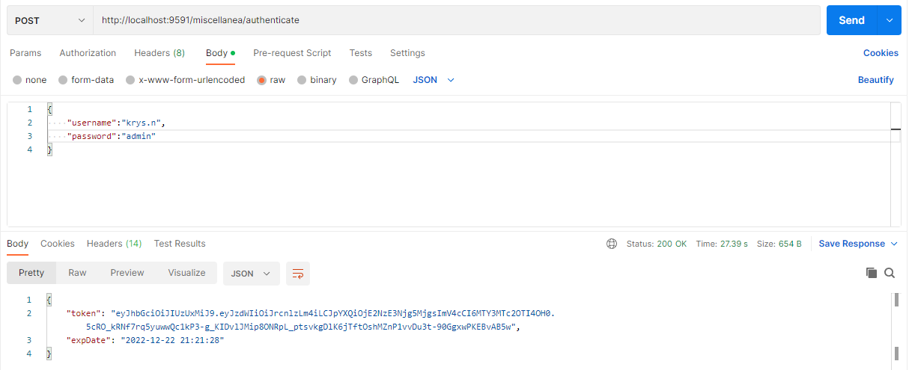
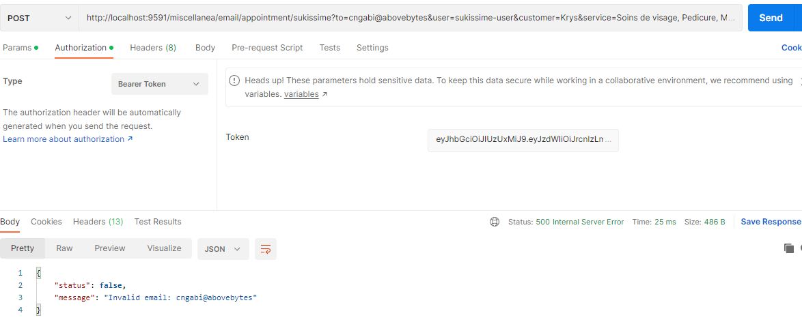
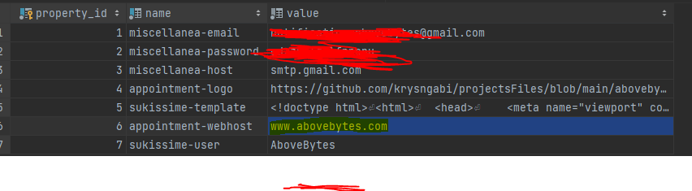
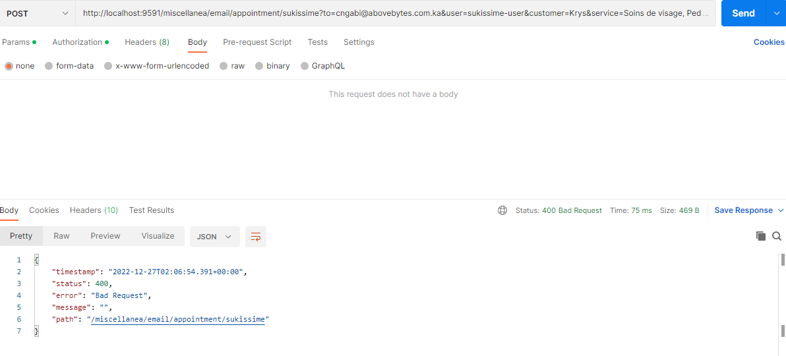

 

  

<h3 align="center">  Miscellanea

</h3>

  

    This project is a little spring project to send html based email with <a href="https://docs.spring.io/spring-framework/docs/3.0.0.M4/reference/html/ch16s04.html">Freemaker</a> and perform multiple actions with DB properties.</li>

  

    

Why 🤔:
* Send custom emails for your existing or new project
* Easy to set up
* Customize your html base email template
* I have added a sample email [appointment.flth](src%2Fmain%2Fresources%2Ftemplates%2Fappointment.flth)

(<a href="#top">back to top</a>)

### Built With

This section should list any major frameworks/libraries used to in our project.

* Java Spring
* MySQL
* Encryption
* JWT

(<a href="#top">back to top</a>)

<!-- GETTING STARTED -->
## Getting Started

Here's are instructions on setting up your project locally.

* Java 1.8 or higher
* Mysql
* Create a DB of your choice (there is an attached sql script, please insert your email address and password)
* Since June 2022 Gmail is not allowing low secured apps anymore, you need to generate a password to use as <a href="https://support.google.com/accounts/answer/185833?hl=en">Generate App Password</a>
* Import the project in your IDE (strongly recommend IntelliJ)
* Use this in VM Options -Dspring.datasource.url=jdbc:mysql://localhost:3306/miscellanea -Dspring.datasource.username=XXXX -Dspring.datasource.password=XXXX -Dspring.profiles.active=profile -Dspring.datasource.driver-class-name=com.mysql.cj.jdbc.Driver

Use cases.

* Get the token with the user/password : <a href="#">http://localhost:9591/miscellanea/authenticate</a>
 

    
 
  

* Send an email : <a href="#">http://localhost:9591/miscellanea/email/appointment/sukissime?to=XXXXX@gmail.com&user=sukissime-user&customer=Christian Ngabi&service=Soins de visage, Pedicure, Massage, Manicure&template=sukissime-template&date=Lundi, 26/12/2022 19:13</a>
   
* Invalid Email  
  

      
   

* Database Screenshot  
  

      
   

* Invalid Token/Unauthorized   
  

      
   

